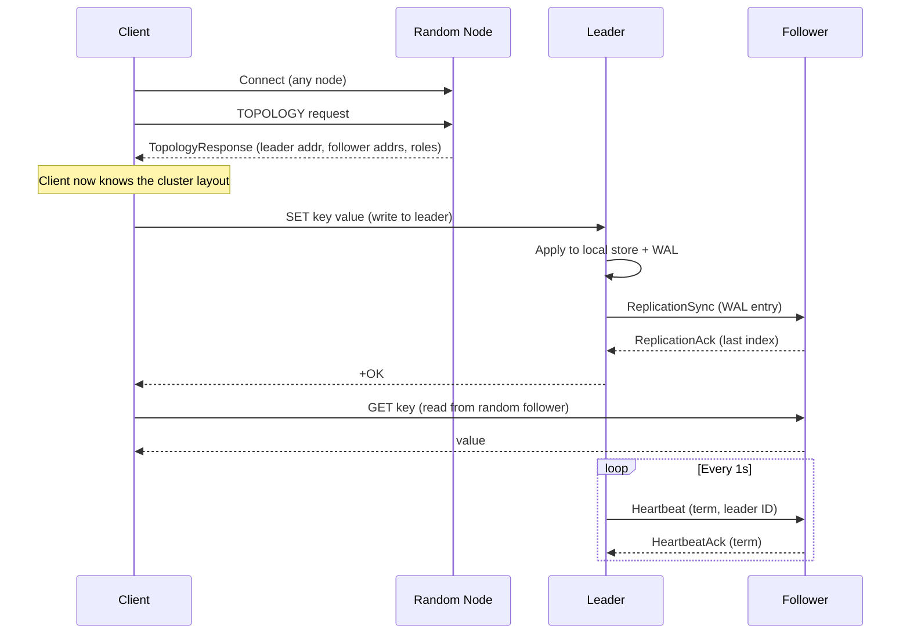

# Protocol Layer for Distributed Key-Value Store

Build a type-safe, registry-pattern-based protocol layer for inter-node and client-to-node communication in the distributed KV store.

## Architecture Overview



## Current State

The existing `protocol/` package has two stub files:
- [payload.go](file:///home/mohd-adil/Desktop/keyvaluestore/protocol/payload.go) — A `Payload` interface with `OpCode()`, `Encode()`, `Decode()` methods
- [set_payload.go](file:///home/mohd-adil/Desktop/keyvaluestore/protocol/set_payload.go) — A bare `SetPayload` struct with `LSN`, `Key`, `Value` (no method implementations)

These stubs align with the registry pattern we'll build. We'll expand on this foundation.

## Design: Registry Pattern

The registry pattern means:
1. Every message type implements the `Message` interface
2. Each message has a unique `OpCode` (1-byte type discriminator)
3. A central `Registry` maps opcode → factory function, so we can decode any wire message without hardcoding switch statements
4. Encoding: `[OpCode 1B] [Payload ...]` — the caller wraps this in the existing `[Length 4B]` TCP frame

```go
// Registry maps OpCode -> constructor function
var registry = map[byte]func() Message{}

func Register(code byte, factory func() Message) { registry[code] = factory }
func Lookup(code byte) (Message, bool) { ... }
```

This is extensible — adding a new message type is just one `Register()` call + a struct.

## Proposed Changes

### Protocol Package (complete rewrite of existing stubs + new files)

---

#### [MODIFY] [payload.go](file:///home/mohd-adil/Desktop/keyvaluestore/protocol/payload.go)

Rename the interface from `Payload` to `Message` for clarity, and add the registry:

```go
// Message is the interface every protocol message must implement.
type Message interface {
    OpCode() byte
    Encode() ([]byte, error)
    Decode(data []byte) error
}
```

Plus the registry functions: `Register()`, `Lookup()`, `EncodeMessage()`, `DecodeMessage()`.

`EncodeMessage` prepends the opcode byte: `[OpCode 1B][Payload ...]`
`DecodeMessage` reads the first byte, looks up the factory, constructs the struct, and calls `Decode()`.

---

#### [MODIFY] [set_payload.go](file:///home/mohd-adil/Desktop/keyvaluestore/protocol/set_payload.go)

Complete implementation of `SetPayload` with proper `Encode()`/`Decode()` methods:

**Wire format:**
```
[KeyLen 2B] [ValueLen 4B] [TTL 8B] [Key ...] [Value ...]
```

Fields: `Key []byte`, `Value []byte`, `TTL uint64` (nanoseconds).

---

#### [NEW] `protocol/opcodes.go`

Central opcode constants:

| OpCode | Name | Direction | Purpose |
|--------|------|-----------|---------|
| `0x01` | `OpGet` | Client → Node | Read a key |
| `0x02` | `OpSet` | Client → Leader | Write a key |
| `0x03` | `OpDelete` | Client → Leader | Delete a key |
| `0x04` | `OpGetResponse` | Node → Client | Response to GET |
| `0x05` | `OpSetResponse` | Leader → Client | Response to SET |
| `0x06` | `OpDeleteResponse` | Leader → Client | Response to DEL |
| `0x10` | `OpTopologyRequest` | Client → Any Node | Discover cluster layout |
| `0x11` | `OpTopologyResponse` | Node → Client | Cluster layout response |
| `0x20` | `OpReplicationSync` | Leader → Follower | Stream WAL entry |
| `0x21` | `OpReplicationAck` | Follower → Leader | Acknowledge replication |
| `0x30` | `OpHeartbeat` | Leader → Follower | Liveness ping |
| `0x31` | `OpHeartbeatAck` | Follower → Leader | Liveness pong |
| `0x40` | `OpVoteRequest` | Candidate → Peer | Election vote request |
| `0x41` | `OpVoteResponse` | Peer → Candidate | Election vote response |
| `0x50` | `OpForwardWrite` | Follower → Leader | Forward client write |
| `0x51` | `OpForwardWriteResponse` | Leader → Follower | Response to forwarded write |
| `0xFE` | `OpError` | Any → Any | Error response |

---

#### [NEW] `protocol/get_payload.go`

```
Wire: [KeyLen 2B] [Key ...]
```

---

#### [NEW] `protocol/get_response.go`

```
Wire: [Found 1B] [ValueLen 4B] [Value ...]
```

`Found` is `0x01` if key exists, `0x00` if not.

---

#### [NEW] `protocol/delete_payload.go`

```
Wire: [KeyLen 2B] [Key ...]
```

---

#### [NEW] `protocol/response_payload.go`

Generic success/error response for SET, DELETE:

```
Wire: [Success 1B] [MsgLen 2B] [Message ...]
```

---

#### [NEW] `protocol/topology.go`

**TopologyRequest**: Empty payload (just the opcode is enough).

**TopologyResponse**:
```
Wire: [LeaderAddrLen 2B] [LeaderAddr ...] [NodeCount 2B]
     For each node:
       [AddrLen 2B] [Addr ...] [Role 1B] [NodeIDLen 2B] [NodeID ...]
```

This gives the client:
- The leader's address (for writes)
- A list of all nodes with their roles (for selecting a random follower for reads)

---

#### [NEW] `protocol/replication.go`

**ReplicationSync** — Leader streams a WAL entry to followers:
```
Wire: [LogIndex 8B] [Op 1B] [KeyLen 2B] [ValueLen 4B] [TTL 8B] [Key ...] [Value ...]
```

**ReplicationAck** — Follower confirms it applied up to an index:
```
Wire: [LastAppliedIndex 8B]
```

---

#### [NEW] `protocol/heartbeat.go`

**Heartbeat** (Leader → Followers):
```
Wire: [Term 8B] [LeaderIDLen 2B] [LeaderID ...]
```

**HeartbeatAck** (Follower → Leader):
```
Wire: [Term 8B] [LastAppliedIndex 8B]
```

---

#### [NEW] `protocol/election.go`

**VoteRequest** (Candidate → Peers):
```
Wire: [Term 8B] [CandidateIDLen 2B] [CandidateID ...] [LastLogIndex 8B]
```

**VoteResponse** (Peer → Candidate):
```
Wire: [Term 8B] [Granted 1B]
```

---

#### [NEW] `protocol/forward.go`

**ForwardWrite** — Follower wraps a client's write command and sends it to the leader:
```
Wire: [OriginalOpCode 1B] [PayloadLen 4B] [OriginalPayload ...]
```

**ForwardWriteResponse** — Leader responds:
```
Wire: [Success 1B] [ResponseOpCode 1B] [ResponseLen 4B] [ResponsePayload ...]
```

---

#### [NEW] `protocol/error.go`

**ErrorMessage**:
```
Wire: [Code 2B] [MsgLen 2B] [Message ...]
```

Standard error codes: `ErrNotLeader = 1`, `ErrKeyNotFound = 2`, `ErrInternal = 3`, etc.

---

#### [NEW] `protocol/registry_init.go`

Auto-registers all message types via `init()`:
```go
func init() {
    Register(OpGet, func() Message { return &GetPayload{} })
    Register(OpSet, func() Message { return &SetPayload{} })
    // ... all types
}
```

---

#### [NEW] `protocol/protocol_test.go`

Round-trip tests for every message type: Encode → Decode → assert equality.

## File Summary

| File | Status | Purpose |
|------|--------|---------|
| `protocol/payload.go` | MODIFY | Message interface + Registry |
| `protocol/opcodes.go` | NEW | All opcode constants |
| `protocol/set_payload.go` | MODIFY | Complete SET message |
| `protocol/get_payload.go` | NEW | GET request message |
| `protocol/get_response.go` | NEW | GET response message |
| `protocol/delete_payload.go` | NEW | DELETE request message |
| `protocol/response_payload.go` | NEW | Generic success/error response |
| `protocol/topology.go` | NEW | Topology request/response |
| `protocol/replication.go` | NEW | Replication sync/ack |
| `protocol/heartbeat.go` | NEW | Heartbeat/ack |
| `protocol/election.go` | NEW | Vote request/response |
| `protocol/forward.go` | NEW | Write forwarding |
| `protocol/error.go` | NEW | Error message |
| `protocol/registry_init.go` | NEW | Auto-registration via init() |
| `protocol/protocol_test.go` | NEW | Round-trip encode/decode tests |

